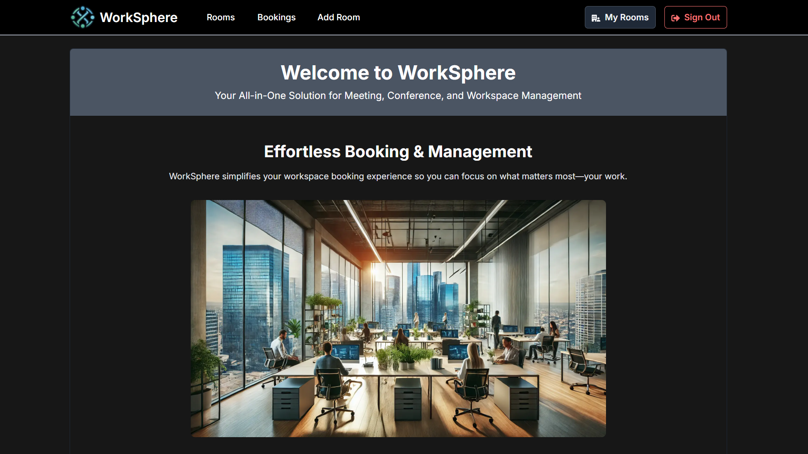

# WorkSphere: Effortless Meeting and Workspace Booking



WorkSphere is an all-in-one solution for meeting, conference, and workspace management. Easily book, add, delete, and cancel meeting rooms and workspaces with real-time availability, flexible scheduling, and seamless collaboration.

## Features

- **Seamless Bookings**: Reserve meeting rooms, conference spaces, or work zones with just a few clicks.
- **Real-Time Availability**: Always know which spaces are free with live availability updates.
- **Flexible Scheduling**: Adapt to your dynamic needs with recurring bookings, instant cancellations, and time-slot adjustments.

## Getting Started

### Prerequisites

- Node.js
- npm

### Installation

1. Clone the repository:
    ```sh
    git clone https://github.com/ksaiprashanth/worksphere.git
    cd worksphere
    ```

2. Install dependencies:
    ```sh
    npm install
    ```

3. Create a [`.env.local`](.env.local) file and add your environment variables:
    ```sh
    NEXT_PUBLIC_APPWRITE_ENDPOINT=your_appwrite_endpoint
    NEXT_PUBLIC_APPWRITE_PROJECT=your_appwrite_project_id
    NEXT_APPWRITE_KEY=your_appwrite_api_key
    NEXT_PUBLIC_APPWRITE_DATABASE=your_appwrite_database_id
    NEXT_PUBLIC_APPWRITE_COLLECTIONS_BOOKINGS=your_appwrite_bookings_collection_id
    NEXT_PUBLIC_APPWRITE_COLLECTIONS_ROOMS=your_appwrite_rooms_collection_id
    NEXT_PUBLIC_APPWRITE_STORAGE_BUCKET_ROOMS=your_appwrite_storage_bucket_id
    ```

4. Run the development server:
    ```sh
    npm run dev
    ```

5. Open [http://localhost:3000](http://localhost:3000) with your browser to see the result.

## Scripts

- `npm run dev`: Runs the development server.
- `npm run build`: Builds the application for production.
- `npm run start`: Starts the production server.
- `npm run lint`: Runs ESLint to check for linting errors.

## Usage

### Authentication

Users need to **register** and **log in** to access the platform. The authentication system ensures secure access to the features.

### Booking a Room

To book a room, navigate to the **Rooms** page, select the desired room and time slot, and confirm your booking.

### Adding a Room

To add a new room, navigate to the **Add Room** page, fill in the room details, and submit the form.

### Deleting a Room

To delete a room, navigate to the **My Rooms** age, select the room you want to delete, and confirm the deletion.

### Canceling a Booking

To cancel a booking, navigate to your **Bookings** page, select the booking you want to cancel, and confirm the cancellation.

## Contributing

We welcome contributions from the community! To contribute:

1. Fork the repository.
2. Create a new branch (`git checkout -b feature/your-feature-name`).
3. Make your changes.
4. Commit your changes (`git commit -m 'Add some feature'`).
5. Push to the branch (`git push origin feature/your-feature-name`).
6. Open a pull request.

Please make sure to update tests as appropriate.

## License

This project is licensed under the [MIT License](LICENSE).
